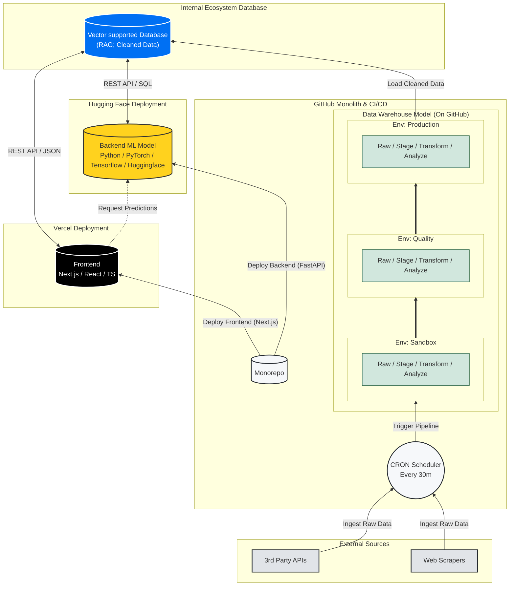

  

   

  
  
  

---

## 👨‍💻 Executive Summary

This repository aims is to showcase data architecture, design considerations, risk assessment, documentation, and roadmap of features in development. This document outlines the strategic design choices to minimize cost while maximizing the capabilities within this constraint. To design this project for the foreseeable future, it's longevity and sustainability must remain free of charge. Therefore, the project design will be small-scale, proof of concept showcasing aptitude for designing, developing, and deploying software. 

To demonstrate agentic fullstack software engineering, atleast one of the following will be implemented using continious integration and continous deployment from GitHub acting as our data warehouse backend, to utilizing Vercel for it's intended purpose as a frontend as a service:
* database
* algorithmic model
* agentic model

The purpose of this is to ***show, not tell, my personal [portfolio/resume](src/docs/Thomas_To_Resume.pdf?raw=true)*** and serves as an open source resource to others as a learning resource or to continue building on this framework themselves.

## 🤖 About Me

I am a **(Founding) Engineer** with a formal background in [Biochemical Engineering](https://catalog.ucdavis.edu/departments-programs-degrees/chemical-engineering/biochemical-engineering-bs/#requirementstext), and [research](https://mcnair.ucdavis.edu/sites/g/files/dgvnsk476/files/inline-files/Design%20to%20Data%20for%20mutants%20of%20%CE%B2-glucosidase%20B%20from%20Paenibacillus%20polymyxa%20L171G%2C%20L171V%20and%20L171W.pdf), applying fullstack software engineering in various fields and usecases on a strong mathematical and emperical foundation to design end-to-end architectures that bridge physical reality with cloud infrastructure. 

My experience spans the entire data lifecycle—from capturing empirical data on the manufacturing floor to digitizing it via enterprise ETL/ELT pipelines and digitulizing it through Agentic Machine Learning and automated applications for digital transformation. By architecting data models and pipelines that accurately reflect real-world processes, I deliver tangible value, driving efficiency, revenue generation, and optimization through scalable, reality-grounded software solutions.

> **We've seen how even simplistic algorithms can automate manual workflows. Now with Agentic methods, I combine classical fullstack methods with agentic AI/ML solutions to drive reality into the future.**

As of Dec 2025, I have taken on reaching out to protein academics to support GenAI of novel designs leveraging my formal background. Working in industry with tech during the day and protein design by night.

## 🛠 Tech Stack & Core Competencies
| **🤖 AI & Agentic Systems** | **📊 Data & Analytics** | **💻 Full Stack & API** | **☁️ Cloud, DevOps & IoT** | **🧬 Bio-Computation** |
| :--- | :--- | :--- | :--- | :--- |
| **LangChain** | **Snowflake** | **Python** | **Google Cloud** | **pyRosetta** |
| **RAG / LLMs** | **dbt** | **TypeScript** | **AWS** | **pyMol** |
| **PyTorch** | **PostgreSQL** | **Next.js** | **Docker** | **Benchling** |
| **TensorFlow** | **Tableau** | **React.js** | **Kubernetes** | **OpenCV** |
| **Hugging Face** | **Fivetran** | **RestAPI** | **CI/CD** | **ImageJ / Fiji** |

---

## Summary of System Architecture: ETL & Data Flow

This diagram illustrates the automated pipeline moving data from external sources into Github "database folder" for accumulated (semantic) pre-processing of raw data from sandbox, test, to product with raw, staging, transform, and analyze layers before moving enviornments to Server-side database, Vercel Edge Config for low-latency frontend access.

### System Design Conclusions
* 30 minute CRON frequency [See KPIs](markdown/architecture.md#system-design-key-performance-indicators-kpi)
* 1 server-side (vercel) integrated database [See Vercel Limits](markdown/architecture.md#vercel-free-hobby-limitation-specifications)

More information can be found in each respective section:
[Architecture](markdown/architecture.md)
[Database](markdown/database.md)
[API](markdown/api.md)
[Deployment](markdown/deployment.md)

### 🏗️ Built Using

| **Core Infrastructure** | **Frontend** | **Data & Backend** | **AI & Integrations** |
| :--- | :--- | :--- | :--- |
| **Git & GitHub** (Version Control + "Database") | **React** (UI Library) | **Vercel Blob** (Object Storage) | **Gemini API** (GenAI Logic) |
| **Vercel** (Edge Hosting & Deployment) | **TypeScript** (Type Safety) | **AWS DynamoDB** (NoSQL / Roadmap) | **Hugging Face** (Model Inference) |
| **GitHub Actions** (CI/CD & CRON Workers) | **Next.js** (Server Components) | **Node.js** (ETL Scripting) | **Open API** (Coincap) |
| **Markdown** (Documentation as Code) | **Tailwind CSS** (Styling) | **OpenSSH** (Secure Auth) | **RESTful API** (public-apis) |

(<a href="#readme-top">back to top</a>)

---