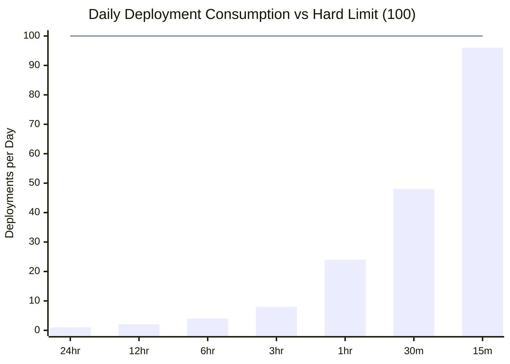
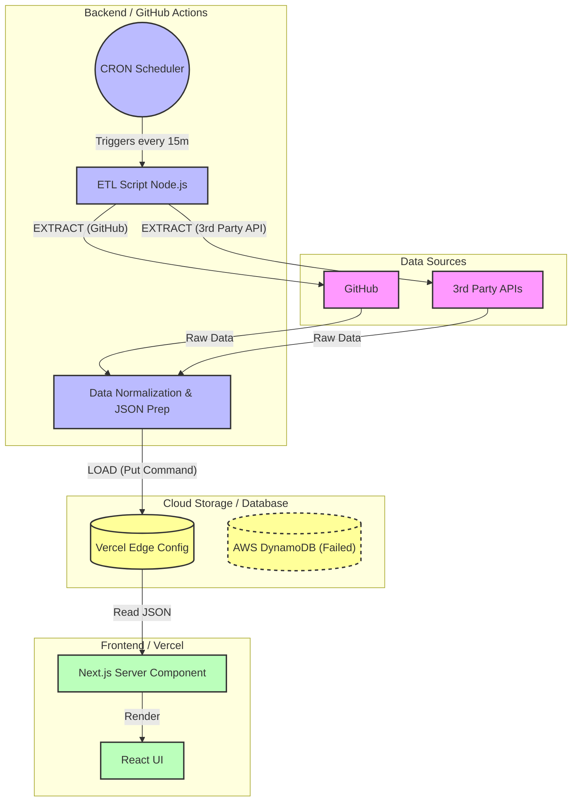

  

   

  
  
  

---

## 👨‍💻 Executive Summary

This repository serves as a **Proof of Concept (PoC)** for a scalable data ingestion system. The aim is to showcase high level data architecture, bottleneck design considerations (price, security, scope), documentation of roadblocks, and next step roadmaps of features in development. 

The main purpose of this is to ***show, not tell, my personal portfolio*** and serves as an open source resource to others as  learning resource or to continue building on this framework themselves.

## 🤖 About Me

I am a **Founding Fullstack (AI/ML) Engineer** with a background in **Biochemical Engineering**. This background has allowed me to experience first-hand, on-the-floor and off-the-floor manufacturing experiences to design end-to-end architecture and data models to reflect "physical reality."

Experienced with **Zero-to-One Architecture**: starting from the generation of empirically obtained data, digitized into enterprise systems (ETL/ELT), and utilized for **Agentic Machine Learning**, data analytics, and automated applications.

> **Core Philosophy:** "Even simplistic algorithms can automate manual workflows. Now with Agentic methods, I combine classical fullstack methods with agentic AI/ML solutions to drive reality into the future."

## 🛠 Tech Stack & Core Competencies

| **🤖 AI & Agentic Systems** | **📊 Data & Analytics** | **💻 Full Stack & API** | **☁️ Cloud, DevOps & IoT** |
| :--- | :--- | :--- | :--- |
| **LangChain** | **Snowflake** | **Python** | **Google Cloud** |
| **RAG / LLMs** | **dbt** | **TypeScript** | **AWS** |
| **PyTorch** | **PostgreSQL** | **Next.js** | **Docker** |
| **TensorFlow** | **Tableau** | **React.js** | **Kubernetes** |
| **Hugging Face** | **Fivetran** | **FastAPI** | **CI/CD** |

### 🧬 Bio-Computation Tools
* **Molecular Modeling:** pyRosetta, pyMol, Benchling
* **Computer Vision:** ImageJ, Fiji, OpenCV

---

## 🛠 Project Tech Stack

### 🏗️ Built Using
This portfolio is a live "Serverless & Agentic" proof-of-concept built using the following stack:

| **Core Infrastructure** | **Frontend Experience** | **Data & Backend** | **AI & Integrations** |
| :--- | :--- | :--- | :--- |
| **Git & GitHub** (Version Control + "Database") | **React** (UI Library) | **Vercel Blob** (Object Storage) | **Gemini API** (GenAI Logic) |
| **Vercel** (Edge Hosting & Deployment) | **TypeScript** (Type Safety) | **AWS DynamoDB** (NoSQL / Roadmap) | **Hugging Face** (Model Inference) |
| **GitHub Actions** (CI/CD & CRON Workers) | **Next.js** (Server Components) | **Node.js** (ETL Scripting) | **Coinbase API** (Fintech Data) |
| **Markdown** (Documentation as Code) | **Tailwind CSS** (Styling) |  | **REST / GraphQL** (Cross-Platform API) |

---

[🏠 Home](/README.md) | [🏗️ Architecture](#Project_Architecture) | [🚀 Deployment](deployment)

---

  
<b>📚 Table of Contents</b>

  <ol>
    <li><a href="#executive-summary">Executive Summary</a></li>
    <li>
      <a href="#architecture">Featured Architecture</a>
      <ul>
        <li><a href="#system-design">System Design Highlights</a></li>
      </ul>
    </li>
    <li><a href="#tech-stack">Tech Stack & Core Competencies</a></li>
    <li><a href="#experience">Experience Highlights</a></li>
    <li><a href="#documentation">Design & Documentation (GxP)</a></li>
    <li><a href="#connect">Connect With Me</a></li>
  </ol>

## 🏗️ Project Architecture:
To design this project for the foreseeable future, it's longevity and sustainability must remain free of charge. Therefore, the project design will be small-scale, proof of concept showcasing aptitude for designing, developing, and deploying software. 

To demonstrate agentic fullstack software engineering, atleast one database, one algorithmic model, and one agentic model will be implemented using continious integration and continous deployment from GitHub acting as our data warehouse backend, to utilizing Vercel for it's intended purpose as a frontend as a service.

This document outlines the strategic design choices to minimize cost while maximizing the capabilities within this constraint. Additional information can be found in the [markdown](/markdown) folder.

(<a href="#readme-top">back to top</a>)

### System Design Key Performance Indicators (KPI):
| Feature | **GitHub Public Repo (Free)** | **Vercel Hobby (Free)** |
| :--- | :--- | :--- |
| **Usage Limit** | **Unlimited Minutes** | **2 Cron Jobs Total** |
| **Reset Logic** | **Fixed Date** (Billing Cycle Start) | **Rolling Window** (24h & 30d) |
| **Max Frequency** | Every 5 minutes | **Once per Day** (24 hours) |
| **Execution Time** | Up to **6 hours** per run | Max **10–60 seconds** |
| **Precision** | Low (delay 5–30 mins) | Low (delay up to 1 hour) |
| **Resource Access** | Full VM (Filesystem, CLI, Docker) | HTTP Endpoint only (Serverless) |
| **Overages** | N/A (Always free for public) | **None** (Hard stop at limit) |

### The "Vercel-Pinger" Solution (Technical Hack)
To bypass the Vercel scheduling limit, we utilize the **GitHub Action -> Vercel Webhook** pattern:
1.  **Schedule:** Set GitHub Action.
2.  **Execute:** GitHub performs the ETL (Scraping/API Calls).
3.  **Trigger:** GitHub commits the new data file (`data.json`) to the repo.
4.  **Deploy:** The commit automatically triggers a Vercel deployment.

*Result:* We achieve high-frequency updates using GitHub's scheduler, bypassing Vercel's Cron limits entirely.
To ensure the system never hits a "Hard Stop," we calculate the safe frequency based on Vercel's daily limit of **100 deployments**.

(<a href="#readme-top">back to top</a>)

## Deployment Frequency & Risk Assessment

The following analyzes the operational risks and potential cost bottlenecks associated with automated deployment frequencies on the Vercel platform.

**The Bottleneck:** The platform imposes a hard limit of **100 deployments per rolling 24-hour period**. Exceeding this limit results in an immediate **"Deployment Block,"** preventing critical hotfixes and manual updates until the rolling window clears.

**The Financial Risk:** High-frequency deployment strategies (e.g., every 15 minutes) not only risk hitting the hard cap but also exponentially consume **Build Minutes**. While the primary constraint is the count limit, excessive build duration will trigger overage charges on Pro plans or suspension on Free tiers.

---

## Consumption vs. Limits

The chart below visualizes the deployment consumption against the platform's hard limit. The "Danger Zone" begins where automated usage consumes the safety buffer required for manual intervention.

## Mathematical Risk Model

To quantify operational stability, we define the **Risk Factor ($R$)** as the percentage of the daily limit consumed by automation.

### The Formulas

$$
\text{Let } T = \text{Interval in Minutes}
$$

$$
\text{Daily Usage } (U) = \frac{1440 \text{ min}}{T}
$$

$$
\text{Risk Factor } (R) = \left( \frac{U}{L_{max}} \right) \times 100\%
$$

### Risk Condition Logic
We define three operational states based on the Risk Factor ($R$). A system is considered "Unstable" if it consumes the 20% buffer reserved for manual hotfixes.

$$
\text{Condition:} \quad
\begin{cases} 
   R \leq 80\% & \text{SAFE} \\
   80\% < R < 100\% & \text{CRITICAL} \\
   R \geq 100\% & \text{FAILURE} 
\end{cases}
$$

### Example Calculation (15-Minute Interval)
Running a deployment every 15 minutes utilizes **96%** of the daily capacity immediately:

$$
\text{At } T=15\text{min}: \quad R = \left( \frac{96}{100} \right) \times 100\% = \mathbf{96\%} \quad (\text{CRITICAL})
$$

*Result: Only 4 slots remain for manual intervention. This is operationally negligent.*

---

## Optimization: The Maximum Allowable Frequency

To determine the fastest possible safe interval ($T_{safe}$) that utilizes exactly 80% of the daily capacity (leaving exactly 20 slots for engineers):

$$
\text{Target Usage } (U_{safe}) = L_{max} \times 0.80 = 80 \text{ deployments}
$$

$$
T_{safe} = \frac{1440 \text{ min}}{U_{safe}}
$$

$$
T_{safe} = \frac{1440}{80} = \mathbf{18 \text{ minutes}}
$$

**Result:** An interval of **18 minutes** is the mathematical hard limit for safety.

### Comparison: Hourly vs. 30 Minutes
The following table compares the capacity impact of standard cron schedules against the platform hard limit ($L_{max}=100$).

| Metric | Hourly ($60$ min) | 30 Minutes |
| :--- | :--- | :--- |
| **Daily Deploys ($U$)** | $24$ | $48$ |
| **Risk Factor ($R$)** | $24\%$ | $48\%$ |
| **Status** | ✅ **SAFE** | ⚠️ **CAUTION** |
| **Buffer Remaining** | $76$ slots | $52$ slots |

### Mathematical Proof

**Case A: Hourly Schedule**
$$
T = 60 \text{ min}
$$
$$
R_{60} = \left( \frac{1440 / 60}{100} \right) \times 100\% = \mathbf{24\%}
$$

**Case B: 30-Minute Schedule**
$$
T = 30 \text{ min}
$$
$$
R_{30} = \left( \frac{1440 / 30}{100} \right) \times 100\% = \mathbf{48\%}
$$

### Final Decision
30 Minutes during active development and maintenace of tools while under continous deployment and allow for continual uptime for users to interact with the production server upto 20 minutes when the project life cycle has reached it's Stewardship phase and is no longer undergoing development of new features given the (financial) constraints previously mentioned.

An additional layer of security for risk migitation can be to omit triggering changes to deploy and develop in an local enviornment when working in the backend.

(<a href="#readme-top">back to top</a>)

### Database:

This project was initially scoped for the use of AWS database services; opting for dynamoDB, to support both structured and unstructured data types as a way to demonstrate use of AWS Cloud infrastructure. However, the free license expires after a year or when credits end. An alternative database solution from reviewing [Vercel documentation](https://vercel.com/docs/storage#choosing-a-storage-product) was identified sufficient for latency, durability, and consistent performance in this proof of concept; designed for as "real-time" as possible, Edge Config.

The selected database and it's respective [limits and pricing](https://vercel.com/docs/edge-config/edge-config-limits) has been conducted using [Edge Config API Endpoint](https://vercel.com/docs/edge-config/using-edge-config#querying-edge-config-endpoints) to ingest third party API data not otherwise manually scraped, transformed, and loaded into the github repository.

### Algorithmic model:
Refactoring previous proprietary financial technology, the minimum viable product for this deliverable will be to feed in coinbase API REST API calls to our database and displayed onto the frontend. This will be the basis dataset for fresh data being accumulated overtime upto the storage limitations of the database where "expired" data will be removed.

note: Algorithmic models & methods are inherently static by design.

### Agentic model:
As of Dec 2025, Gemini was selected as the LLM due to better support for free features (i.e number of tokens) compared to other providers. Due to the free limitiations, an agentic news letter will be designed as one-way, ran daily; or weekly, depeneding on previous KPI metrics.

More robust agentic models and methods (e.g RAG) are out of scope at this time of a minimally viable product to showcase agentic compentecy and capabilities not in a professional setting.

*(This diagram is live-rendered by GitHub using Mermaid.js)*

(<a href="#readme-top">back to top</a>)
