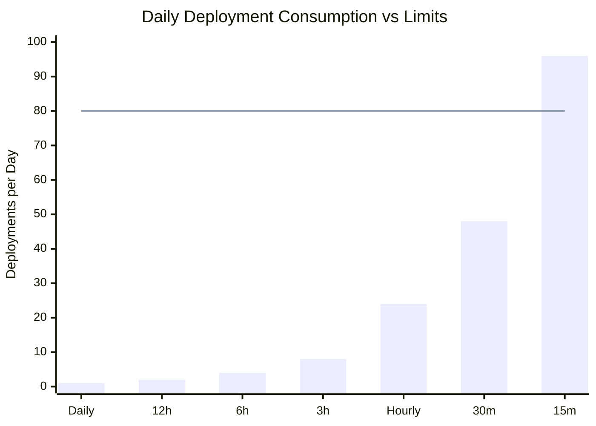
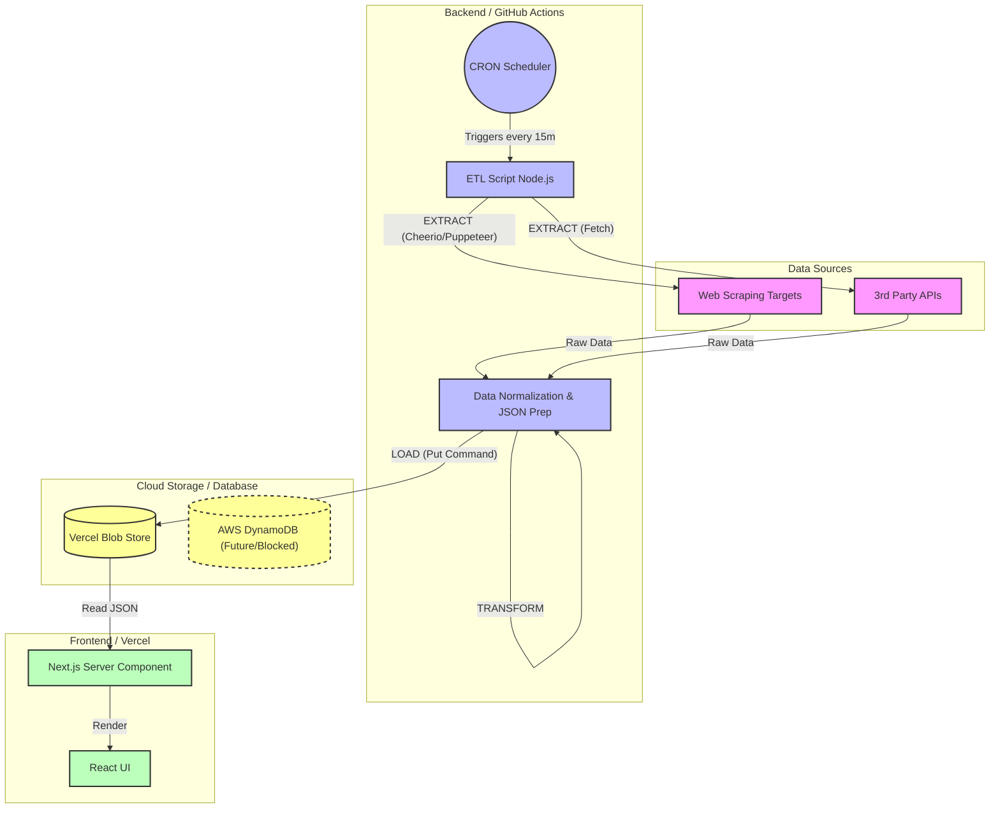

  

   

  
  
  

---

## 👨‍💻 Executive Summary

This repository serves as a **Proof of Concept (PoC)** for a scalable data ingestion system. The aim is to showcase high level data architecture, bottleneck design considerations (price, security, scope), documentation of roadblocks, and next step roadmaps of features in development. 

The main purpose of this is to ***show, not tell, my personal portfolio*** and serves as an open source resource to others as  learning resource or to continue building on this framework themselves.

## 🤖 About Me

I am a **Founding Fullstack (AI/ML) Engineer** with a background in **Biochemical Engineering**. This background has allowed me to experience first-hand, on-the-floor and off-the-floor manufacturing experiences to design end-to-end architecture and data models to reflect "physical reality."

Experienced with **Zero-to-One Architecture**: starting from the generation of empirically obtained data, digitized into enterprise systems (ETL/ELT), and utilized for **Agentic Machine Learning**, data analytics, and automated applications.

> **Core Philosophy:** "Even simplistic algorithms can automate manual workflows. Now with Agentic methods, I combine classical fullstack methods with agentic AI/ML solutions to drive reality into the future."

## 🛠 Tech Stack & Core Competencies

| **🤖 AI & Agentic Systems** | **📊 Data & Analytics** | **💻 Full Stack & API** | **☁️ Cloud, DevOps & IoT** |
| :--- | :--- | :--- | :--- |
| **LangChain** | **Snowflake** | **Python** | **Google Cloud** |
| **RAG / LLMs** | **dbt** | **TypeScript** | **AWS** |
| **PyTorch** | **PostgreSQL** | **Next.js** | **Docker** |
| **TensorFlow** | **Tableau** | **React.js** | **Kubernetes** |
| **Hugging Face** | **Fivetran** | **FastAPI** | **CI/CD** |

### 🧬 Bio-Computation Tools
* **Molecular Modeling:** pyRosetta, pyMol, Benchling
* **Computer Vision:** ImageJ, Fiji, OpenCV

---

## 🛠 Project Tech Stack

### 🏗️ Built Using
This portfolio is a live "Serverless & Agentic" proof-of-concept built using the following stack:

| **Core Infrastructure** | **Frontend Experience** | **Data & Backend** | **AI & Integrations** |
| :--- | :--- | :--- | :--- |
| **Git & GitHub** (Version Control + "Database") | **React** (UI Library) | **Vercel Blob** (Object Storage) | **Gemini API** (GenAI Logic) |
| **Vercel** (Edge Hosting & Deployment) | **TypeScript** (Type Safety) | **AWS DynamoDB** (NoSQL / Roadmap) | **Hugging Face** (Model Inference) |
| **GitHub Actions** (CI/CD & CRON Workers) | **Next.js** (Server Components) | **Node.js** (ETL Scripting) | **Coinbase API** (Fintech Data) |
| **Markdown** (Documentation as Code) | **Tailwind CSS** (Styling) |  | **REST / GraphQL** (Cross-Platform API) |

---

[🏠 Home](/README.md) | [🏗️ Architecture](#Project_Architecture) | [🚀 Deployment](deployment)

---

  
<b>📚 Table of Contents</b>

  <ol>
    <li><a href="#executive-summary">Executive Summary</a></li>
    <li>
      <a href="#architecture">Featured Architecture</a>
      <ul>
        <li><a href="#system-design">System Design Highlights</a></li>
      </ul>
    </li>
    <li><a href="#tech-stack">Tech Stack & Core Competencies</a></li>
    <li><a href="#experience">Experience Highlights</a></li>
    <li><a href="#documentation">Design & Documentation (GxP)</a></li>
    <li><a href="#connect">Connect With Me</a></li>
  </ol>

## 🏗️ Project Architecture:
To design this project for the foreseeable future, it's longevity and sustainability must remain free of charge. Therefore, the project design will be small-scale, proof of concept showcasing aptitude for designing, developing, and deploying software. 

To demonstrate agentic fullstack software engineering, atleast one database, one algorithmic model, and one agentic model will be implemented using continious integration and continous deployment from GitHub acting as our data warehouse backend, to utilizing Vercel for it's intended purpose as a frontend as a service.

This document outlines the strategic design choices to minimize cost while maximizing the capabilities within this constraint. Additional information can be found in the [markdown](/markdown) folder.

(<a href="#readme-top">back to top</a>)

### System Design Key Performance Indicators (KPI):
| Feature | **GitHub Public Repo (Free)** | **Vercel Hobby (Free)** |
| :--- | :--- | :--- |
| **Usage Limit** | **Unlimited Minutes** | **2 Cron Jobs Total** |
| **Reset Logic** | **Fixed Date** (Billing Cycle Start) | **Rolling Window** (24h & 30d) |
| **Max Frequency** | Every 5 minutes | **Once per Day** (24 hours) |
| **Execution Time** | Up to **6 hours** per run | Max **10–60 seconds** |
| **Precision** | Low (delay 5–30 mins) | Low (delay up to 1 hour) |
| **Resource Access** | Full VM (Filesystem, CLI, Docker) | HTTP Endpoint only (Serverless) |
| **Overages** | N/A (Always free for public) | **None** (Hard stop at limit) |

### The "Vercel-Pinger" Solution (Technical Hack)
To bypass the Vercel scheduling limit, we utilize the **GitHub Action -> Vercel Webhook** pattern:
1.  **Schedule:** Set GitHub Action.
2.  **Execute:** GitHub performs the ETL (Scraping/API Calls).
3.  **Trigger:** GitHub commits the new data file (`data.json`) to the repo.
4.  **Deploy:** The commit automatically triggers a Vercel deployment.

*Result:* We achieve high-frequency updates using GitHub's scheduler, bypassing Vercel's Cron limits entirely.
To ensure the system never hits a "Hard Stop," we calculate the safe frequency based on Vercel's daily limit of **100 deployments**.

### The Calculation
* **Limit:** $100$ Deployments / $24$ Hours.
* **Safety Buffer:** Leave $20\%$ headroom for manual hotfixes/commits ($20$ deploys).
* **Available Slots:** $80$ Deployments / $24$ Hours.

**Formula:**
$$\text{Available Slots} = L \times (1 - B)$$

Where:
* $L = 100$ (Daily Limit)
* $B = 0.20$ (Safety Buffer)
* Result: $80$ available automated slots per day.

```mermaid
%%{init: {'theme': 'base', 'themeVariables': { 'primaryColor': '#0070f3', 'secondaryColor': '#ff0000', 'tertiaryColor': '#fff'}}}%%
gantt
    title Vercel Deployment Consumption (Daily Limit: 100)
    dateFormat X
    axisFormat %s
    
    section Safe Zone (0-80)
    Daily (1)           : 0, 1
    Hourly (24)         : 0, 24
    Every 30m (48)      : 0, 48
    
    section Danger Zone (80-100)
    Every 15m (96)      : crit, 0, 96
    HARD LIMIT (100)    : milestone, 100, 100 
```

### Recommendation
**Safe Maximum Frequency: Hourly (24 Deployments/Day)**

* **Cost:** $0.00 (Free).
* **Capacity Used:** 24% of daily limit.
* **Risk:** Extremely Low. Even if multiple commits occur, the rolling window will easily absorb 24 automated deploys plus manual work.

**Warning:** Do **not** exceed a frequency of **Every 15 Minutes** (96 deploys/day). This creates a "Red Zone" risk where a single manual commit could lock your project for 24 hours.

(<a href="#readme-top">back to top</a>)

### Database:

This project was initially scoped for the use of AWS database services; opting for dynamoDB, to support both structured and unstructured data types as a way to demonstrate use of AWS Cloud infrastructure. However, the free license expires after a year or when credits end. An alternative database solution from reviewing [Vercel documentation](https://vercel.com/docs/storage#choosing-a-storage-product) was identified sufficient for latency, durability, and consistent performance in this proof of concept; designed for as "real-time" as possible, Edge Config.

The selected database and it's respective [limits and pricing](https://vercel.com/docs/edge-config/edge-config-limits) has been conducted using [Edge Config API Endpoint](https://vercel.com/docs/edge-config/using-edge-config#querying-edge-config-endpoints) to ingest third party API data not otherwise manually scraped, transformed, and loaded into the github repository.

### Algorithmic model:
Refactoring previous proprietary financial technology, the minimum viable product for this deliverable will be to feed in coinbase API REST API calls to our database and displayed onto the frontend. This will be the basis dataset for fresh data being accumulated overtime upto the storage limitations of the database where "expired" data will be removed.

note: Algorithmic models & methods are inherently static by design.

### Agentic model:
As of Dec 2025, Gemini was selected as the LLM due to better support for free features (i.e number of tokens) compared to other providers. Due to the free limitiations, an agentic news letter will be designed as one-way, ran daily; or weekly, depeneding on previous KPI metrics.

More robust agentic models and methods (e.g RAG) are out of scope at this time of a minimally viable product to showcase agentic compentecy and capabilities not in a professional setting.

*(This diagram is live-rendered by GitHub using Mermaid.js)*

(<a href="#readme-top">back to top</a>)
