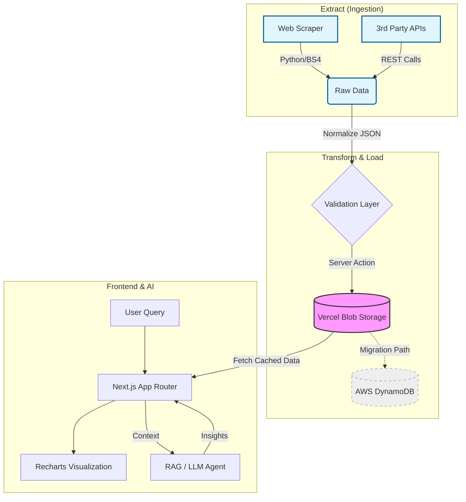

```mermaid
graph TD
    %% Nodes
    subgraph "Extract (Ingestion)"
        A[Web Scraper] -->|Python/BS4| C(Raw Data)
        B[3rd Party APIs] -->|REST Calls| C
    end

    subgraph "Transform & Load"
        C -->|Normalize JSON| D{Validation Layer}
        D -->|Server Action| E[(Vercel Blob Storage)]
        style E fill:#f9f,stroke:#333,stroke-width:2px
        
        E -.->|Migration Path| F[(AWS DynamoDB)]
        style F fill:#eee,stroke:#999,stroke-dasharray: 5 5
    end

    subgraph "Frontend & AI"
        E -->|Fetch Cached Data| G[Next.js App Router]
        G --> H[Recharts Visualization]
        
        I[User Query] --> G
        G -->|Context| J[RAG / LLM Agent]
        J -->|Insights| G
    end

    %% Styles
    classDef source fill:#e1f5fe,stroke:#01579b,stroke-width:2px;
    class A,B,C source;
```
